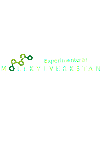

[![Contributors][contributors-shield]][contributors-url]
[![Forks][forks-shield]][forks-url]
[![Stargazers][stars-shield]][stars-url]
[![Issues][issues-shield]][issues-url]

<!-- PROJECT LOGO -->
 

  

  

  <h3 align="center">Molmap</h3>

  

    QR-code reader for Molekylverskan from TC-Stenungsund.
     
    <a href="https://tcstenungsund.github.io/molmap/"><strong>Check out the QR-code reader! »</strong></a>
     
     
    <a href="https://github.com/tcstenungsund/molmap/issues">Report Bug</a>
    ·
    <a href="https://github.com/tcstenungsund/molmap/issues">Request Feature</a>
  

<!-- TABLE OF CONTENTS -->

  
Table of Contents

  <ol>
    <li>
        <a href="#usage">Usage</a>
        <ul>
            <li>Navigating to the QR-code reader</li>
        </ul>
    </li>
    <li><a href="#built-with">Built With</a></li>
  </ol>

<!-- USAGE EXAMPLES -->

## Usage

#### Navigating to the QR-code reader

To use this QR-code reader simply navigate to https://tcstenungsund.github.io/molmap/.

<!-- BUILT WITH -->

## Built With

Molmap was built by using these languages and tools

- JS
- HTML
- CSS
- Markdown
- [Github Pages](https://pages.github.com/)

(<a href="#top">back to top</a>)

[contributors-shield]: https://img.shields.io/github/contributors/tcstenungsund/molmap.svg?style=for-the-badge
[contributors-url]: https://github.com/tcstenungsund/molmap/graphs/contributors
[forks-shield]: https://img.shields.io/github/forks/tcstenungsund/molmap.svg?style=for-the-badge
[forks-url]: https://github.com/tcstenungsund/molmap/network/members
[stars-shield]: https://img.shields.io/github/stars/tcstenungsund/molmap.svg?style=for-the-badge
[stars-url]: https://github.com/tcstenungsund/molmap/stargazers
[issues-shield]: https://img.shields.io/github/issues/tcstenungsund/molmap.svg?style=for-the-badge
[issues-url]: https://github.com/tcstenungsund/molmap/issues
[license-shield]: https://img.shields.io/github/license/tcstenungsund/molmap.svg?style=for-the-badge
[license-url]: https://github.com/tcstenungsund/molmap/blob/master/LICENSE.txt
[product-screenshot]: images/screenshot.png
